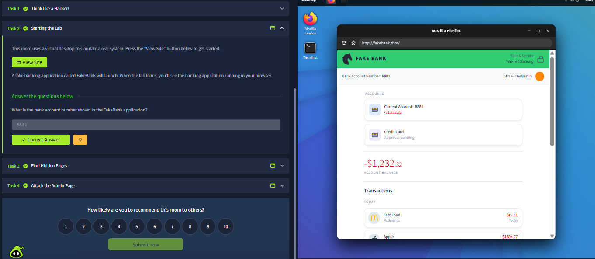
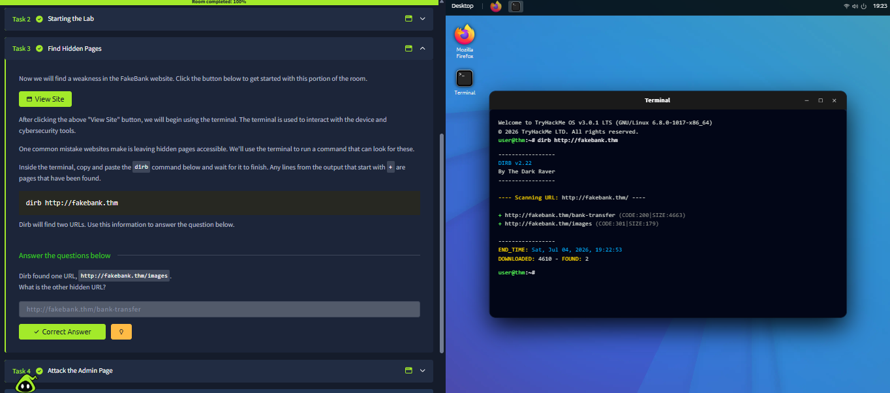
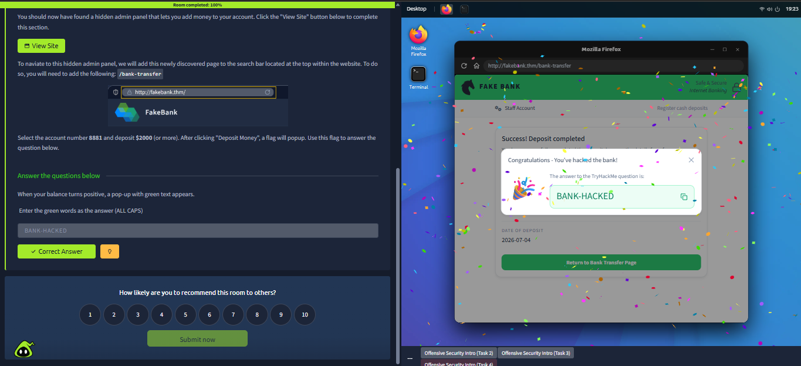
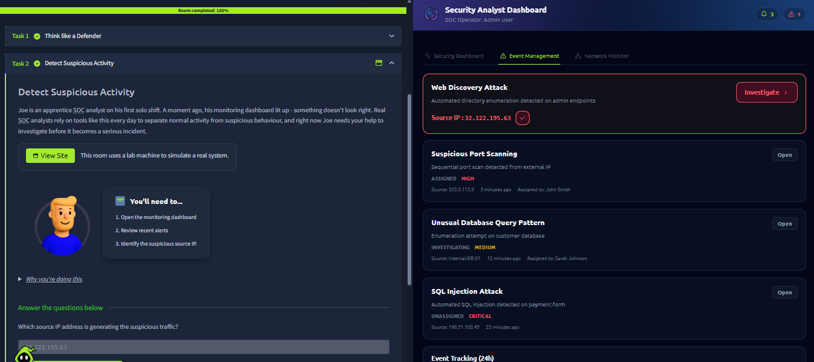
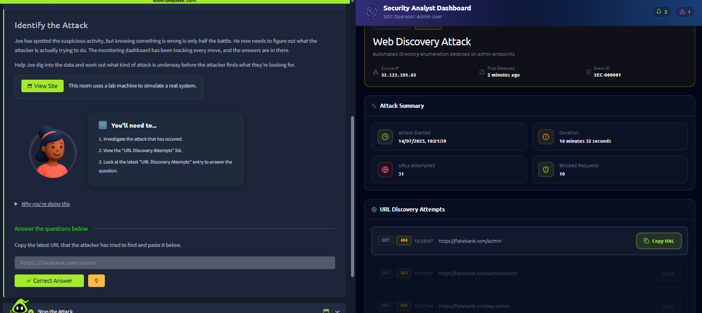
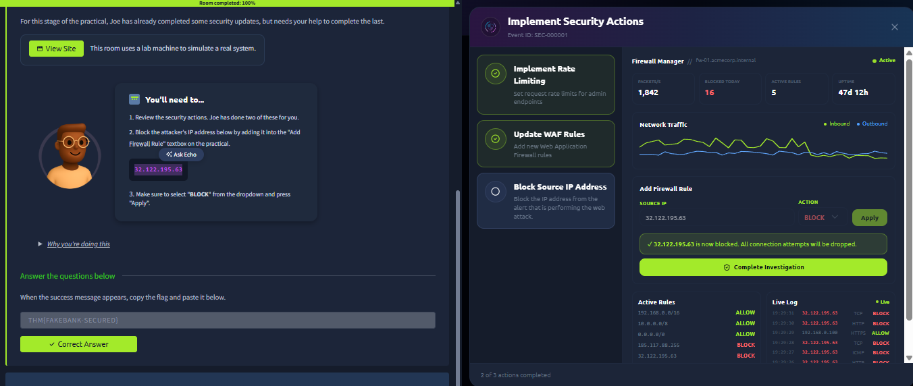

# Module 1 — Introduction to Cybersecurity

## Module Overview

This module introduced the fundamentals of cybersecurity, including offensive security, defensive security, and various career paths within the cybersecurity industry. The module also included several hands-on labs that demonstrated both attack and defense concepts.

---

# Section 1 — Offensive Security

## Notes

- Offensive security involves thinking like an attacker to find weaknesses before real hackers do.
- Used the Linux terminal during lab exercises.
- Used the `dirb` command:

```bash
dirb http://<ip-address>
```

- Pages beginning with `(+)` indicated directories or pages that were discovered.
- Located a fake bank website and discovered an admin page.
- Used the newly discovered page to investigate the hidden admin panel.

### Skills Practiced

- Linux Terminal
- Directory Enumeration
- Web Application Discovery
- Basic Penetration Testing Concepts

### Lab Evidence

#### Task 2 – Bank Account Discovery



#### Task 3 – DIRB Enumeration



#### Task 4 – Hidden Admin Page Investigation



# Section 2 — Defensive Security

## Notes

- Defensive security focuses on defending and securing devices and systems.
- Security teams work to detect, investigate, and respond to attacks before damage occurs.
- SOC (Security Operations Center) analysts use dashboards and monitoring tools to identify suspicious activity.
- Containment is the process of stopping an attack while it is actively occurring.
- During the lab, I secured the fake bank environment by implementing a firewall rule and blocking the attacking IP address.

### Skills Practiced

- SOC Monitoring
- Threat Investigation
- Incident Response
- Containment Procedures

### Lab Evidence

#### Task 2 – SOC Dashboard Investigation



#### Task 3 – Attack Investigation



#### Task 4 – Attack Mitigation



---

# Section 3 — Cyber Careers

## Notes

- Cybersecurity consists of many different career paths.
- There is high demand in the cybersecurity industry, with millions of unfilled positions.
- Entry-level cybersecurity positions often provide competitive salaries.
- Cybersecurity requires continuous learning because technology evolves quickly.

### Career Paths Explored

- Security Analyst
- Security Engineer
- Penetration Tester

### Skills Learned

- Career Identification
- Industry Research
- Understanding Roles and Responsibilities
```