# Module 2 - Computer Fundamentals

## Overview

This module introduced the foundational concepts of how computers, networks, virtualization, and cloud technologies work. Through hands-on labs and exercises, I explored computer hardware, client-server communication, virtual machines, and cloud infrastructure.

---

# Section 1 - Inside a Computer System

## Learning Objectives

- Understand the purpose of computer hardware components.
- Learn how a computer starts during the boot process.
- Identify the role of each component inside a computer.

## Key Notes

- Motherboard connects all components together.
- CPU executes instructions and processes data.
- RAM provides fast temporary memory.
- HDD and SSD provide long-term storage.
- PSU supplies power to all components.
- Network adapters allow communication between devices.
- GPU processes visual information.

### Boot Sequence

1. Power button pressed.
2. Firmware (BIOS/UEFI) starts.
3. POST checks hardware.
4. System searches for a boot device.
5. Bootloader loads the operating system.

---

# Lab Evidence

### Motherboard Components Diagram

### Component Placement Exercise

### Boot Sequence Practice

---

# Section 2 - Computer Types

## Learning Objectives

- Understand different computer types.
- Learn how devices are designed for specific purposes.
- Compare laptops, desktops, servers, and embedded devices.

## Key Notes

### Computer Types

- Laptop – Portable everyday computing.
- Desktop – Better cooling and sustained performance.
- Workstation – Professional-grade computing.
- Server – Provides services over a network.
- Embedded Systems – Designed for one specific purpose.
- IoT Devices – Connected devices that perform specialized tasks.

---

# Lab Evidence

### Computing Device Types

### Computer Type Comparison

### Smart Device Identification Lab

### Laptop vs Desktop Cooling Lab

### Server Redundancy Lab

### Computer Role Matching Lab

---

# Section 3 - Client-Server Basics

## Learning Objectives

- Understand client-server communication.
- Learn how HTTP requests and responses work.
- Practice inspecting network traffic.

## Key Notes

- Client sends requests to a server.
- Server processes the request and sends a response.
- Protocols are rules for communication.
- Ports are specific access points to services.
- DNS translates domain names into IP addresses.
- HTTP uses GET requests to retrieve web pages.

---

# Lab Evidence

### Client-Server Concepts

### HTTP Communication

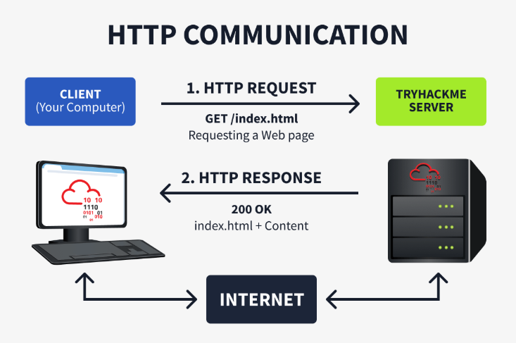

### HTTP GET Request Lab

### HTTP Headers Investigation

### HTTP Response Investigation

---

# Section 4 - Virtualisation Basics

## Learning Objectives

- Understand virtualization concepts.
- Learn how hypervisors and virtual machines work.
- Understand containers and resource management.

## Key Notes

### Hypervisors

- Type 1 runs directly on hardware.
- Type 2 runs inside an operating system.

### Virtual Machines

- Have their own CPU, RAM, storage, and OS.
- Operate independently from other VMs.

### Containers

- Lightweight environments.
- Share the host operating system kernel.
- Start quickly and use fewer resources.

### Benefits of Virtualization

- Better hardware utilization.
- Reduced costs.
- Easier scalability.
- Safe testing environments.

---

# Lab Evidence

### Hypervisor Use Cases

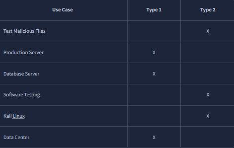

### VM and Container Architecture

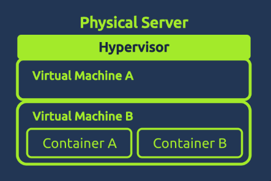

### Mail Server Error State

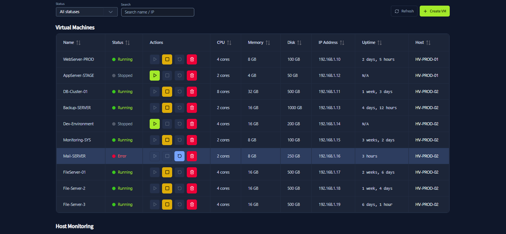

### Creating a Marketing VM

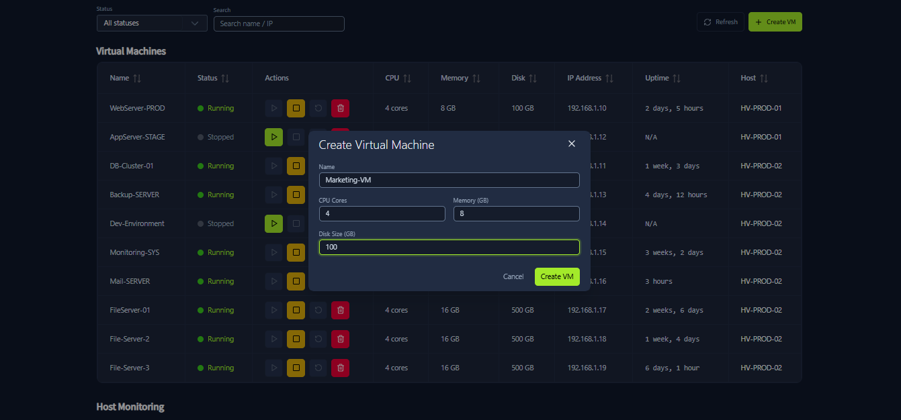

### Marketing VM Created

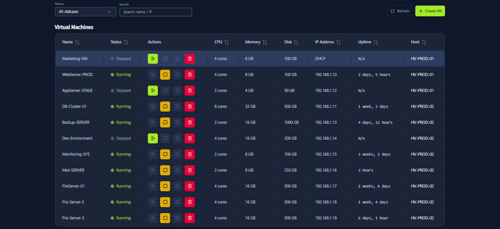

### Host Monitoring Dashboard

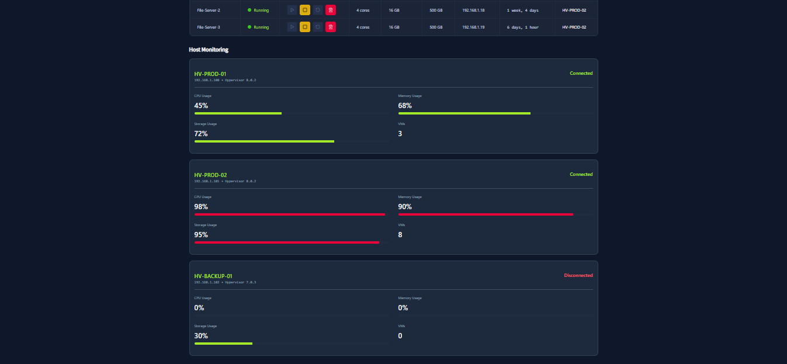

---

# Section 5 - Cloud Computing Fundamentals

## Learning Objectives

- Understand cloud computing concepts.
- Learn cloud deployment and service models.
- Practice creating and managing cloud resources.

## Key Notes

### Cloud Benefits

- Scalability
- On-demand resources
- Pay only for what you use
- High availability
- Global accessibility
- Strong security

### Deployment Models

- Public Cloud
- Private Cloud
- Hybrid Cloud

### Service Models

- IaaS – Infrastructure as a Service
- PaaS – Platform as a Service
- SaaS – Software as a Service

### Cloud Concepts

- EC2 = Virtual computer/server.
- Region = Geographic location.
- Instance Type = Determines performance and cost.
- Stopping unused resources saves money.

### Major Cloud Providers

- Amazon Web Services (AWS)
- Microsoft Azure
- Google Cloud Platform (GCP)
- IBM Cloud
- Oracle Cloud
- Alibaba Cloud

---

# Lab Evidence

### Evolution to the Cloud

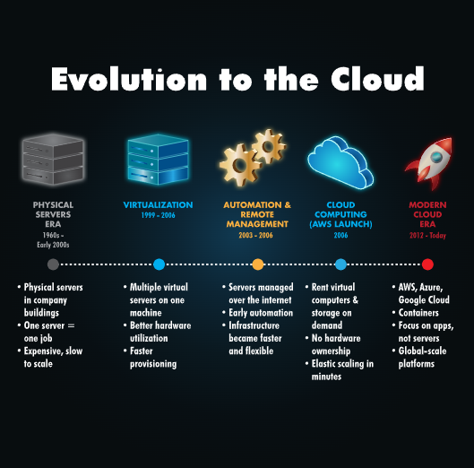

### IaaS vs PaaS vs SaaS

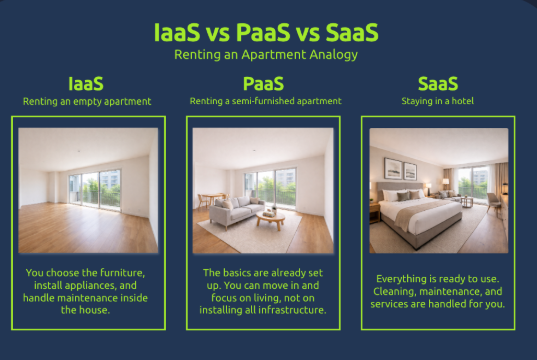

### Selecting a Region

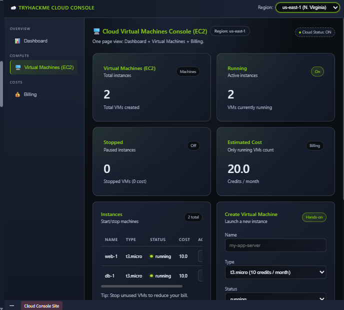

### Creating Application Interface VM

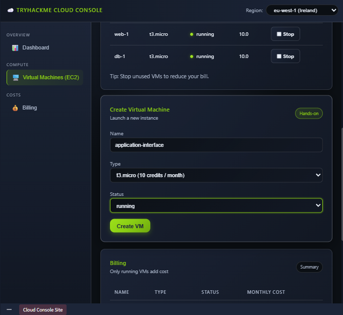

### Creating Study Machine

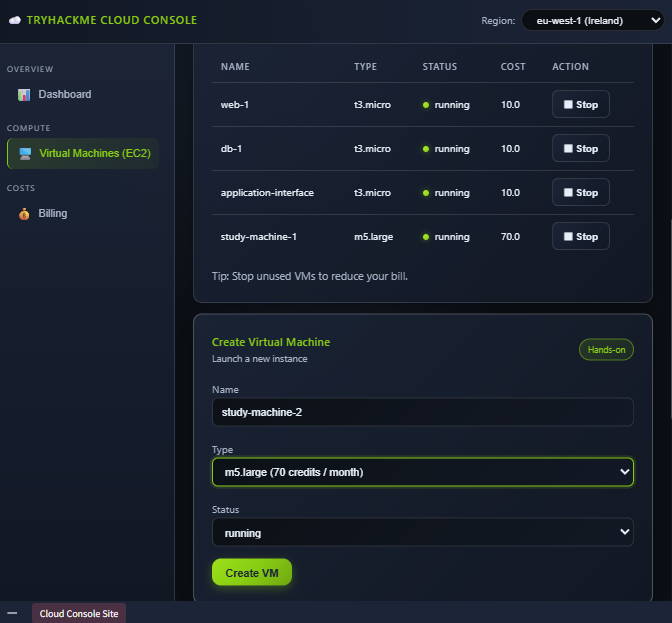

### Cloud Instances Dashboard

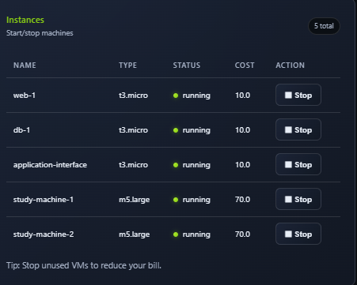

### Billing Before Optimization

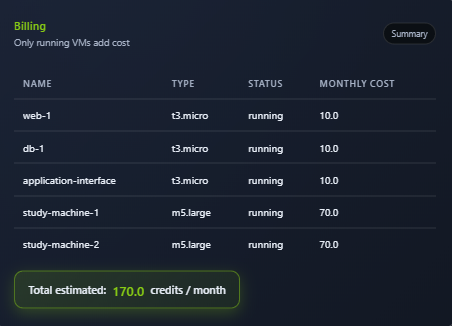

### Cost Optimization

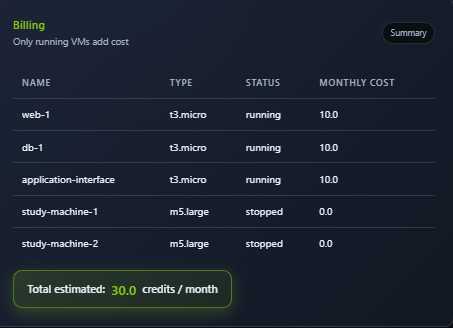

---

# Skills Gained

- Computer hardware fundamentals
- Boot sequence analysis
- Device classification
- Client-server communication
- HTTP and web traffic analysis
- Virtualization concepts
- Virtual machine management
- Cloud computing fundamentals
- Cloud cost optimization
- Infrastructure management

---

# Platform

- Training Platform: TryHackMe
- Module: Computer Fundamentals
- Status: Completed ✅